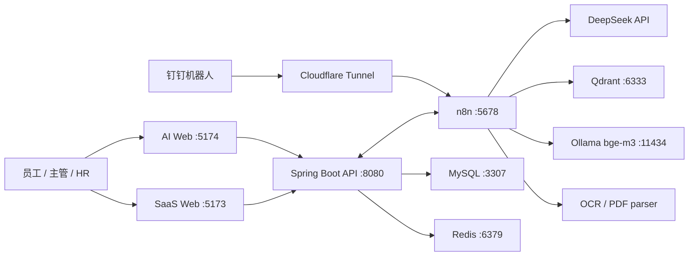

# HRAgent v1

HRAgent 是一个本地运行的员工关系 SaaS Demo，并通过同一套 n8n 智能体连接独立 AI 网页端和钉钉机器人。SaaS 后端是员工身份、组织、权限、假期余额、请假单、证明申请和审批状态的唯一可信来源；n8n 负责对话编排、RAG、文件解析和消息通知。

> 当前版本用于演示和二次开发，不应直接作为生产 HR 系统处理真实敏感数据。

## 已包含的主要能力

- 多企业空间、加入申请、部门、岗位、员工档案和角色权限。
- 员工、主管、空间管理员（HR）和平台管理员界面。
- CSV/XLSX 员工及假期数据导入、通讯录和操作日志。
- 请假预检、工作日计算、余额校验、主管审批、HR 备案和日历展示。
- 独立 AI 网页端，使用 SaaS 账号登录并调用与钉钉相同的 n8n 智能体。
- 钉钉机器人消息、文件解析、审批通知和审批卡片回调。
- n8n + Qdrant + Ollama `bge-m3` 的本地 RAG 知识库。
- PDF/TXT/CSV/XLSX 知识文件导入；聊天入口支持图片 OCR 和常见文档临时分析。
- 个人信息、在职/签证证明申请、DOCX 模板、HR 审核和演示电子签章。
- SaaS API Key、智能体工具接口、调用日志和错误工作流。

## 目录

```text
hragentv1/          Spring Boot 后端、SaaS Vue 前端、Compose 和业务文档
hragent-chat/       独立 AI 网页端（Vue）
n8nwork/            n8n、PostgreSQL、Qdrant、Ollama、OCR、PDF 和工作流
scripts/            初始化、启动、停止、导入、检测、隧道和验收脚本
```

运行数据、数据库卷、n8n 凭据、API Key、员工上传文件和知识库原文件不在仓库中。

## 运行架构



## 必需软件

普通 Docker 运行只要求：

| 软件 | 要求 |
| --- | --- |
| Windows | Windows 10/11 64 位，建议启用 WSL2 |
| Docker Desktop | 较新的稳定版，Linux containers 模式，Compose v2 |
| PowerShell | Windows PowerShell 5.1 或 PowerShell 7 |
| Git | 克隆和更新仓库 |
| 内存/磁盘 | 建议至少 8 GB 可用内存、20 GB 可用磁盘 |
| 网络 | 能访问 Docker Hub、Maven Central、npm、DeepSeek 和 Cloudflare |

Docker 会自动提供以下运行时，无需在主机单独安装：

- Java 21、Maven 3.9.9、Spring Boot 3.3.5
- Node.js 22、nginx 1.27、Vue 3、Vite 5
- MySQL 8.4、Redis 7.4、PostgreSQL 16
- n8n 2.29.11、Qdrant 1.18.3、Ollama 0.32.5
- Python 3.10、FastAPI、RapidOCR、PDF 解析服务
- Cloudflare `cloudflared`

仅在脱离 Docker 开发源码时，才需要本机安装 JDK 21、Maven 3.9、Node.js 22 和 npm。

## 首次安装

### 1. 克隆 v1 分支

```powershell
git clone -b v1 https://github.com/kwewqwe2-hue/hragent.git
cd hragent
```

### 2. 初始化本地配置

```powershell
powershell -ExecutionPolicy Bypass -File .\scripts\initialize-hragent-config.ps1
```

脚本会从示例文件创建以下三个本地文件并生成随机密钥：

```text
hragentv1/.env
n8nwork/.env
n8nwork/saas-agent.env
```

这些文件已被 Git 忽略。不要把真实 API Key 写进 `*.example` 或工作流 JSON。

### 3. 配置代理和 DeepSeek

如果网络不需要代理，可以清空 `n8nwork/.env` 中四个代理变量。如果主机使用代理软件，推荐先在 Docker Desktop 的 `Settings -> Resources -> Proxies` 中配置：

```text
http://127.0.0.1:<主机 HTTP 代理端口>
```

Docker Desktop 配置正确时，示例中的以下地址可以保持不变：

```text
http://http.docker.internal:3128
```

如果直接让容器连接代理软件，则把 `N8N_HTTP_PROXY`、`N8N_HTTPS_PROXY`、`OLLAMA_HTTP_PROXY`、`OLLAMA_HTTPS_PROXY` 改为：

```text
http://host.docker.internal:<代理端口>
```

同时在代理软件中允许局域网连接。

`hragentv1/.env` 的 `DEEPSEEK_API_KEY` 供后端直接模型能力使用，可以暂时留空。主智能体的 DeepSeek Key 必须稍后在 n8n 凭据页面创建，绝不能写入工作流 JSON。

### 4. 首次构建并启动本地服务

先不启动外网隧道：

```powershell
powershell -ExecutionPolicy Bypass -File .\scripts\start-hragent-local.ps1 -Build -PullEmbeddingModel -NoTunnel
```

首次构建需要下载 Maven、npm、Docker 和 Ollama 依赖，耗时取决于网络。成功后访问：

| 服务 | 地址 |
| --- | --- |
| SaaS | http://localhost:5173 |
| 独立 AI 网页端 | http://localhost:5174 |
| SaaS API | http://localhost:8080/api |
| n8n | http://localhost:5678 |
| Qdrant | http://localhost:6333 |

### 5. 初始化 n8n

1. 打开 `http://localhost:5678`，创建本地 n8n Owner 账号。
2. 导入 8 个维护中的工作流，但暂时不要发布：

```powershell
powershell -ExecutionPolicy Bypass -File .\scripts\import-n8n-workflows.ps1
```

3. 在 n8n 创建并重新选择以下本地凭据。导出的工作流只保存凭据名称和旧 ID，不包含密钥，新的 n8n 实例必须重新绑定：

| 凭据名称 | 类型/配置 | 使用位置 |
| --- | --- | --- |
| `DeepSeek account` | DeepSeek API Key | 主智能体的 DeepSeek Chat Model |
| `Qdrant account` | URL `http://qdrant:6333`，本地无 Key | RAG Admin、RAG Ingest |
| `Ollama Local bge-m3` | URL `http://ollama:11434` | RAG Ingest 的 Embeddings Ollama |

4. 登录 SaaS 的空间管理员账号，在“开放平台/接口中心”生成内部 Agent API Key，把它填入：

```text
n8nwork/saas-agent.env
```

格式：

```env
SAAS_AGENT_API_KEY=生成的真实密钥
```

5. 保存工作流后发布全部 8 个工作流：

```powershell
powershell -ExecutionPolicy Bypass -File .\scripts\import-n8n-workflows.ps1 -PublishOnly
```

### 6. 配置钉钉并生成隧道

在 `n8nwork/.env` 填写钉钉内部应用：

```env
DINGTALK_APP_KEY=
DINGTALK_APP_SECRET=
```

创建新的临时隧道：

```powershell
powershell -ExecutionPolicy Bypass -File .\scripts\refresh-hragent-tunnel.ps1 -NewTunnel
```

脚本会自动更新 n8n 的 `WEBHOOK_URL` 和 `DINGTALK_APPROVAL_BASE_URL`，并输出需要填写到钉钉开发者后台的两个地址：

```text
https://<临时域名>/webhook/hragent-dingtalk-8a2d811d-0fe5-4198-8e61-288ec417fc04
https://<临时域名>/webhook/hragent-dingtalk-leave-card
```

Quick Tunnel 域名在重新创建后会变化。更新钉钉回调地址后需要重新发布钉钉应用版本。正式部署应使用固定域名或 Named Tunnel。

### 7. 完整检测

```powershell
powershell -ExecutionPolicy Bypass -File .\scripts\check-hragent-local.ps1
```

关键结果应为：

```text
[OK] Required n8n workflows - active=8/8
[OK] n8n error workflow bindings - bound=7/7
```

## 日常运行

Docker Desktop 已启动时：

```powershell
powershell -ExecutionPolicy Bypass -File .\scripts\start-hragent-local.ps1
```

源码变更后重新构建：

```powershell
powershell -ExecutionPolicy Bypass -File .\scripts\start-hragent-local.ps1 -Build
```

强制更换 Quick Tunnel：

```powershell
powershell -ExecutionPolicy Bypass -File .\scripts\refresh-hragent-tunnel.ps1 -NewTunnel
```

安全停止并保留所有数据：

```powershell
powershell -ExecutionPolicy Bypass -File .\scripts\stop-hragent-local.ps1
```

不要执行 `docker compose down -v`，除非明确要删除 MySQL、n8n、Qdrant、Ollama 和证明文件数据。

## 脚本说明

| 脚本 | 用途 |
| --- | --- |
| `initialize-hragent-config.ps1` | 创建本地 `.env` 并生成随机密钥 |
| `start-hragent-local.ps1` | 启动完整环境、可选构建/模型下载/隧道 |
| `stop-hragent-local.ps1` | 停止容器但保留数据卷 |
| `import-n8n-workflows.ps1` | 首次导入或发布 8 个维护工作流 |
| `refresh-hragent-tunnel.ps1` | 获取隧道并同步 n8n 配置 |
| `check-hragent-local.ps1` | 只读健康检查，不修改配置 |
| `run-hragent-acceptance.ps1` | 边界验收，需要显式传入测试用钉钉用户 ID |

验收示例：

```powershell
powershell -ExecutionPolicy Bypass -File .\scripts\run-hragent-acceptance.ps1 `
  -EmployeeDingTalkUserId '<员工测试 ID>' `
  -ManagerDingTalkUserId '<主管测试 ID>'
```

## Demo 账号

首次创建数据库时会初始化以下演示账号，默认密码均为 `123456`：

| 角色 | 用户名 |
| --- | --- |
| 员工 | `zhangsan` |
| 主管 | `lisi` |
| 空间管理员/HR | `wanghr` |
| 平台管理员 | `platformadmin` |

这些账号只适用于本地 Demo。对外部署前必须删除或修改默认密码和演示个人信息。

## 数据持久化

Docker volumes 保存：

- MySQL 业务数据和 Redis 状态。
- n8n 用户、工作流、凭据和执行记录。
- Qdrant 向量、Ollama 模型和生成的证明文件。
- `n8nwork/knowledge-files` 中的本地知识文件。

Git 只保存源码和安全示例，不保存上述运行数据。迁移到另一台机器或云服务器时，需要单独备份/恢复 Docker volumes 和知识文件。

## 常见问题

### Docker 拉取或 Cloudflare 隧道报连接失败

确认代理端口正在监听，更新 Docker Desktop Proxies 和 `n8nwork/.env` 的四个代理变量，然后重启 Docker Desktop 并重建相关容器：

```powershell
cd n8nwork
docker compose up -d --force-recreate n8n ollama
docker compose --profile quick-tunnel up -d --force-recreate cloudflared-quick
```

### 检测显示 `active=2/8`

工作流仍在数据库中，但导入操作可能把发布状态关闭。重新绑定凭据后执行：

```powershell
powershell -ExecutionPolicy Bypass -File .\scripts\import-n8n-workflows.ps1 -PublishOnly
```

### n8n Cloud 套餐过期

本项目使用本地 Docker n8n 和本地 PostgreSQL，不依赖 n8n Cloud 套餐。Cloud 套餐过期不会删除本地数据，也不会阻止 `http://localhost:5678` 运行。

## 安全边界

- 不提交 `.env`、n8n 凭据、API Key、钉钉 ID、知识文件或数据库导出。
- 角色和数据权限必须由 SaaS 后端校验，不能只依赖提示词。
- AI 对话记忆不能替代真实请假单、余额和审批状态。
- Quick Tunnel 只用于 Demo；生产必须使用 HTTPS 固定域名、备份、监控和密钥轮换。
